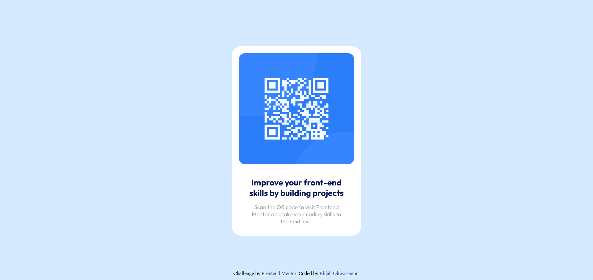
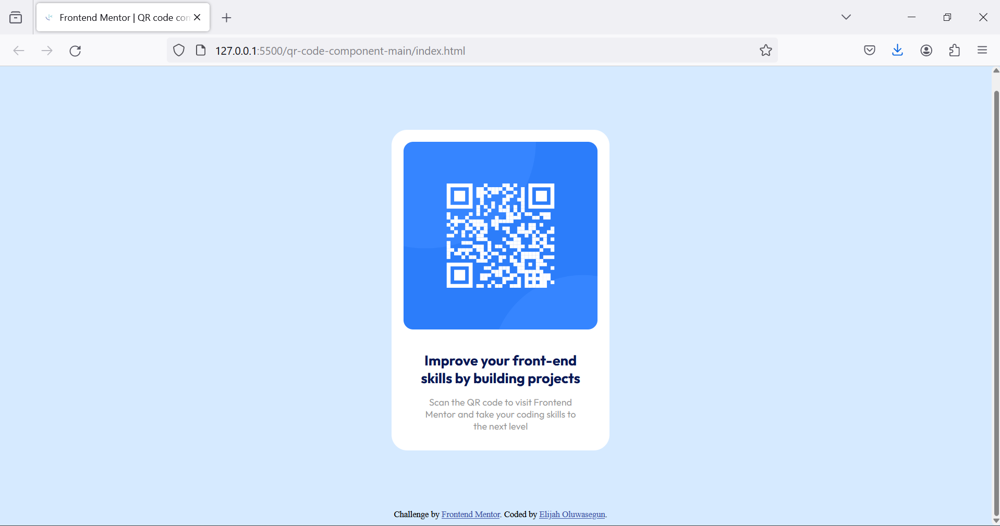
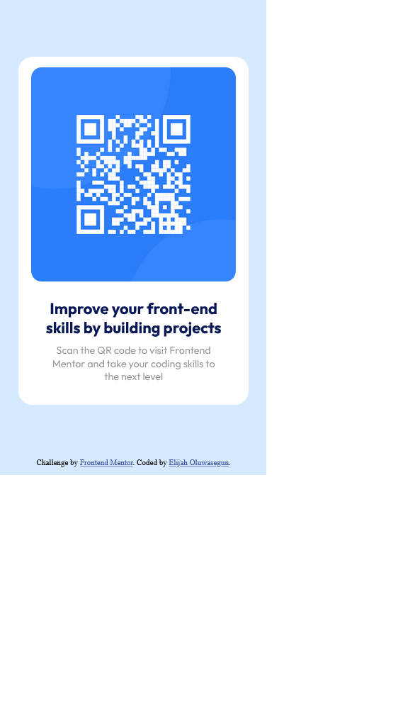
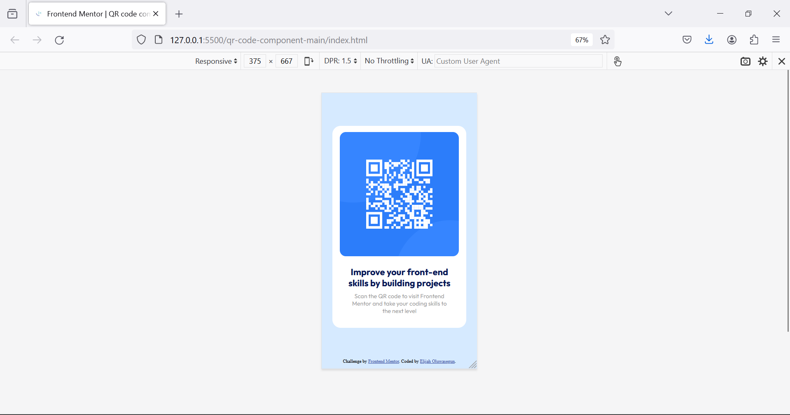

# Frontend Mentor - QR code component solution

This is a solution to the [QR code component challenge on Frontend Mentor](https://www.frontendmentor.io/challenges/qr-code-component-iux_sIO_H). Frontend Mentor challenges help you improve your coding skills by building realistic projects.

## Table of contents

- [Overview](#overview)
  - [Screenshot](#screenshot)
  - [Links](#links)
- [My process](#my-process)
  - [Built with](#built-with)
  - [What I learned](#what-i-learned)
  - [Continued development](#continued-development)
  - [Useful resources](#useful-resources)
- [Author](#author)

## Overview

### Screenshot

**Desktop Solution**



**Mobile Solution**



### Links

- Solution URL: [(https://github.com/ElijahOluwasegun/qr-code-component-main)]
- Live Site URL: [(https://elijaholuwasegun.github.io/qr-code-component-main/)]

## My process

I started by creating the basic HTML structure. Then I added my CSS properties. After this, I pushed my code to Github and deployed it on Github pages.

### Built with

- Semantic HTML5 markup
- CSS custom properties
- Flexbox
- CSS Media queries
- [Styled Components](https://fonts.google.com/) - For font styles

### What I learned

First I used CSS display properties, specifically blocks and inherit. However, after studying more about CSS, I switched to flexbox.

To see how you can add code snippets, see below:

```css
.qr_sect {
  display: block;
  margin-top: 6.25em;
  margin-left: auto;
  margin-right: auto;
  padding-top: 0.625em;
  background-color: rgb(255, 255, 255);
  border: 0.75em;
  border-radius: 1.25em;
  width: 22%;
  height: 2500%;
}
```

```css
.qr_sect {
  display: flex;
  flex-direction: column;
  justify-self: center;
  align-items: center;
  gap: 20px;
  padding-top: 0em;
  background-color: rgb(255, 255, 255);
  border: 0.75em;
  border-radius: 1.25em;
  width: 22%;
  height: 2500%;
}
```

### Continued development

Areas I would love to improve is writing good git commit messages. I would also love to properly grasp CSS flexbox especially when it comes to items, content and self.

### Useful resources

- [Mozilla](https://developer.mozilla.org/en-US/) - This helped me for CSS flexbox. I really liked the detailed information and clarity and will use it going forward.
- [TheOdinProject] (https://www.theodinproject.com/) - This helped me for everything, from HTML, CSS to understanding GIT, Github and linux installation.
- [W3schools](https://www.w3schools.com/) - This is an amazing resource which helped me to quickly understand the basics of HTML and CSS. I'd recommend it to anyone anxious to learn web development.
- [Neko Calc](https://nekocalc.com/) - An underrated resource that supported me to make my solution more responsive. I really liked the simplicity in using the website and recommend it to anyone trying to convert pixel or other values to a required format.
- [Google Fonts](https://fonts.google.com/) - A free resource that helped me to find the font for my text.

## Author

- Frontend Mentor - [@ElijahOluwasegun](https://www.frontendmentor.io/profile/ElijahOluwasegun)
